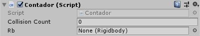
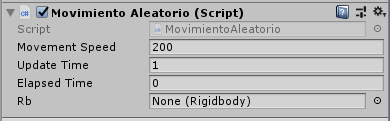
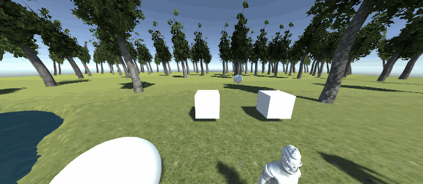
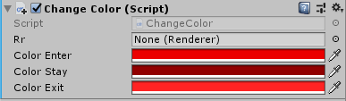
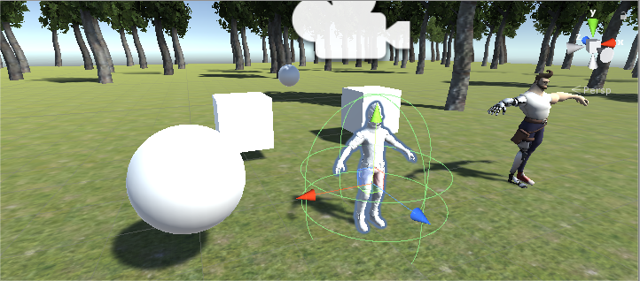
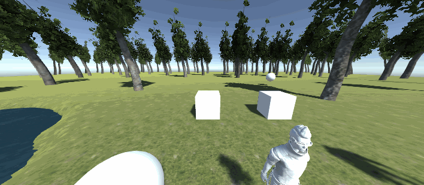
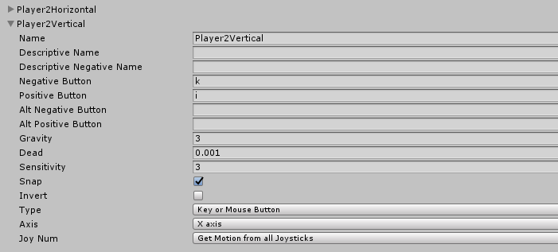
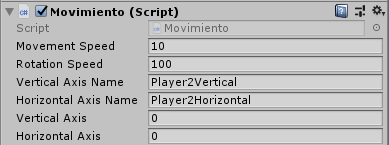

# Físicas en Unity

## Objetivos
Sobre la escena que has trabajado programa los scripts necesarios para las siguientes acciones:

- [x] Cada vez que el objeto jugador colisione con una esfera se debe incrementar un contador.
  * [x] Una de las escenas estará fija, la otra debe estar rodando aleatoriamente por la escena.
- [x] La esfera debe responder a la física.
  * [x] Se deben incluir cilindros que actúen como sensores, de forma que cambian de color cuando el objeto jugador o la esfera estén cerca.
  * [x] Se deben elegir tres tonos de intensidad que se asignarán según el estado de la colisión para cada uno de ellos.
- [x] Ubicar un tercer objeto que sea capaz de detectar colisiones y que se mueva con las teclas: I, L, J, M

### Colisiones con las esferas
El script del contador

[Contador.cs](script/Contador.cs)

El movimiento aleatorio de la segunda bola, la primera está fija.

[MovimientoAleatorio.cs](script/MovimientoAleatorio.cs)

### Detección de colisiones
El script [ChangeColor.cs] detecta las colisiones (sin físicas) y cambia el color de Ethan.

Aplicamos un Capsule Collider más grande que el personaje para que reaccione al jugador cuando estén cerca

### Segundo Jugador
Responde a las físicas ya que tiene un rigidbody y tiene el mismo movimiento que el primer cubo, cambiando la asignación de teclas en unity (nuevos axis)

[Movimiento.cs](script/Movimiento.cs)

